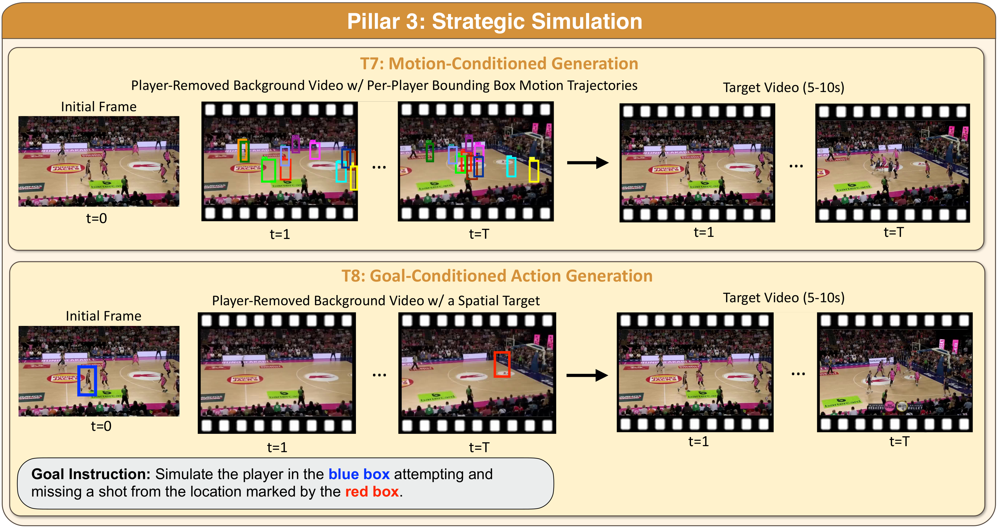

# T7 — Motion-Conditioned Generation



## Task

Inputs:

- an initial frame,
- a player-removed background video,
- per-player bounding-box trajectories (one box per player per frame).

Output: a 5–10 s video in which players follow the prescribed
trajectories with physical and temporal coherence.

T7 targets multi-agent settings with 10+ players moving simultaneously,
interacting, and occluding one another.

## Metrics

| Metric | Definition |
|---|---|
| **Video mIoU** | Spatiotemporal alignment between generated and reference trajectories, accumulated across all frames and matched track pairs. |
| **Temporal feature similarity** | SigLIP2 cosine similarity between per-player crops in generated and reference videos, IoU-gated by the tracker. |

## Install

```bash
pip install "svi-bench[t7]"
```

## Data

```bash
bash scripts/download_t7_t8.sh
```

Layout under `$SVI_BENCH_DATA/T7/{basketball,soccer}/`:

```
clips/{bucket}/{ID}.mp4         5 s game clip, 832×480, 15 fps
bboxes/{bucket}/{ID}.txt        per-frame player bboxes
backgrounds/{bucket}/{ID}.mp4   player-removed background
splits/{train,val,test}.txt    one ID per line
splits/test_100.txt             100-clip evaluation subset
```

`ID` is a zero-padded integer. `bucket` is `ID // 1668` (basketball) or
`ID // 1236` (soccer).

## Train

```bash
SPORT=basketball bash svi_bench/tasks/t7_motion_conditioned_generation/train.sh
SPORT=soccer     bash svi_bench/tasks/t7_motion_conditioned_generation/train.sh
```

Defaults: 3 epochs, lr 1e-4, save every 2000 steps. LoRA rank 32 on the
DiT side (targets `q,k,v,o,ffn.0,ffn.2`). Outputs to
`./models/train/Wan2.1-Fun-V1.1-1.3B-Control-lora_with_bboxs_color_background_81frames_${SPORT}/`.

## Inference

```bash
SPORT=basketball bash svi_bench/tasks/t7_motion_conditioned_generation/inference/infer.sh
SPORT=soccer     bash svi_bench/tasks/t7_motion_conditioned_generation/inference/infer.sh
```

Picks up the latest `step-*.safetensors` checkpoint under the LoRA output
dir and runs `test_100` sharded across `NUM_GPUS=8`. Pass an alternate
checkpoint dir as `$1`.

Pre-trained T7 LoRA checkpoints (basketball + soccer) are on
[`MVP-Group/SVI-Bench`](https://huggingface.co/datasets/MVP-Group/SVI-Bench/tree/main/T7):

```bash
bash svi_bench/tasks/t7_motion_conditioned_generation/download_checkpoint.sh basketball
bash svi_bench/tasks/t7_motion_conditioned_generation/download_checkpoint.sh soccer
```

## Evaluation

```bash
HERE=svi_bench/tasks/t7_motion_conditioned_generation

# 1. Video mIoU (tracker + holistic mIoU)
bash $HERE/eval/run_basketball.sh   <VIDEO_DIR>
bash $HERE/eval/run_soccer.sh       <VIDEO_DIR>

# 2. Feature similarity (reuses tracker output from step 1)
bash $HERE/eval/run_basketball_featsim.sh <STEP_DIR>
bash $HERE/eval/run_soccer_featsim.sh     <STEP_DIR>
```

Results:

```
<VIDEO_DIR>/video_miou_results/summary.json
<STEP_DIR>/feature_sim/summary.json
```

## Files

| Path | Role |
|---|---|
| `train.sh`, `train.py` | training entry |
| `inference/infer.{sh,py}` | multi-GPU inference dispatcher |
| `inference/split_validation_set.py` | shards a split file across GPUs |
| `validate.py` | in-training validation hook |
| `eval/run_{basketball,soccer}.sh` | tracker + Video mIoU |
| `eval/run_{basketball,soccer}_featsim.sh` | feature similarity |
| `eval/video_miou.py`, `eval/feature_sim.py`, `eval/eval_generated_videos.py` | metric workers |
| `eval/yolox/`, `eval/MixViT/`, `eval/exps/` | tracker components |
| `diffsynth/` | Wan2.1-Fun pipeline |
| `infer.py` | `svi-bench evaluate --task t7` CLI entry (inference dispatcher) |
